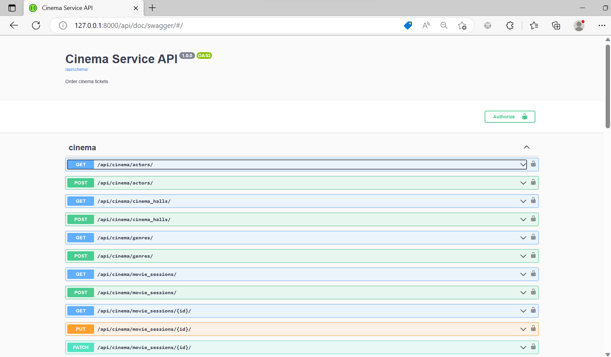
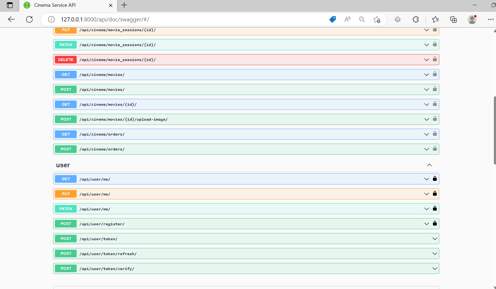

# Cinema API

This API is designed to manage cinemas by allowing administrators to manage movies, genres, actors, cinema halls, and movie sessions. It is written using Django Rest Framework.

## Installing using GitHub:

1. Clone the repository:
```
git clone git@github.com:viktoria-rybenchuk/cinema-api.git
cd cinema
```
2. Create and activate a virtual environment:
```
python -m venv venv
venv\Scripts\activate (on Windows)
source venv/bin/activate (on macOS/Linux)
```
3. Install the requirements:
```
pip install -r requirements.txt
```
4. Set environment variables:
```
set(Windows), export(Mac/Linux) POSTGRES_HOST=<you db hostaname>
set(Windows), export(Mac/Linux) POSTGRES_DB=<your db name>
set(Windows), export(Mac/Linux) POSTGRES_USER=<your db username
set(Windows), export(Mac/Linux) POSTGRES_PASSWORD=<your db user password>
```
5. Run database migrations:
```
python manage.py migrate
python manage.py runserver
```
6. Start the server:
```
python manage.py migrate
```
## Run with Docker
Docker should be installed

```
docker-compose build
docker-compose up
```


## Getting access
- create user via/api/user/register/
- get access token via/api/user/token/

## Features
The Cinema API provides the following features:

- JWT authenticated
- Admin panel/admin
- Documentation is located at /api/doc/swagger/
- Managing movies with genres, actors
- Creating cinema halls 
- Adding movie sessions 
- Filtering movies and movie sessions


